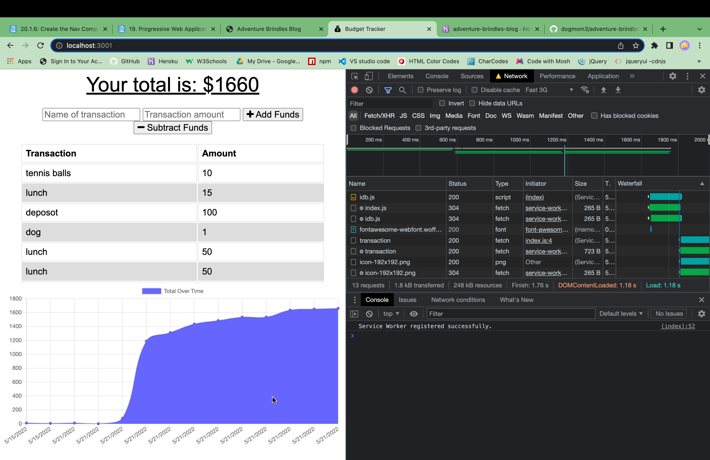

# Budget Tracker App with Offline Functionality

## Description
This is a budget tracking app that works without an internet connection to save the user input and add it into the rest of the data once back online.

## Table of Contents 

- [Usage](#usage)
- [Credits](#credits)

## Usage
Add and subtract items/funds from your budget to keep track of your spending. When offline, you should be able to access the app and make changes to your budget that will then be saved and show up when back online.

## Credits

created by Blair Seivers
-
blair.seivers@gmail.com